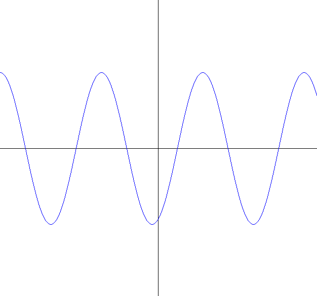

# Y si lo normal es que oscile

El experimento de la doble rendija ha fascinado a la humanidad por su simplicidad y complejidad de interpretación, nos pone ante la posibilidad de que todo y cuanto nos rodea puede ser partículas u ondas.

Por otro lado, el ser humano se ha concentrado en el desarrollo de instrumentos digitales y descuidando que nosotros funcionamos con señales analógicas. En ambos casos, se presentan ondas y su oscilación.

En su naturaleza las ondas nos ofrecen múltiples formas de uso y formas de analizar su comportamiento, entonces en el presente artículo voy a establecer algunas preguntas y qué espero resolver en el futuro.

## Descripción de una onda

$$f(x, t) = A sin(\kappa x - \omega t + \delta)$$

Donde:

* **Position space ($x$)**. Es la posisción en el espacio.
* **Time ($t$)**. Es el tiempo en que se va analizar.
* **Amplitude ($A$)**. Hasta donde llega en el eje $y$.
* **Wave number ($\kappa = 2 \pi / \lambda$)**. El número de ondas transcurrido.

  * **Wave length ($\lambda$)**. El tamaño de la onda.

* **Angular frecuency ($\omega = 2  \pi / \tau$)**. Espacio entre ondas en el eje $x$.

  * **Frequency ($\tau$)**. Frecuencia de la onda.

* **Phase shift ($\delta$)**. Para especificar el inicio.

\newpage
## En Haskell

{width=40%}

```haskell
--
sinusoidalWave :: Float -> Float -> Float -> Float -> Float -> Float -> Float
sinusoidalWave
    amplitude   -- A: units
    wave_length -- lambda: metric
    frequency   -- tau: hz
    phase_shift -- delta: rad
    position_space  -- x: metric
    time            -- t: time
    = amplitude * sin
        ( wave_number * position_space
        - angular_frequency * time
        + phase_shift
        )
    where
        angular_frequency = 2 * pi / frequency -- omega
        wave_number = 2 * pi / wave_length -- kappa
--
```

## Especulación en base a la onda

1. Nuestro cerebro acostumbrado a recibir señales analógicas: ¿Puede llegar a formar una función predictiva? ¿Lo que conocemos como instinto?

2. El individuo afecta a la su entorno y la suma de individuos son afectados por el entorno: ¿Se puede interpretar la sociedad en base a una onda oscilatoria? ¿Tiene sus puntos máximos y mínimos en periodos de análisis?

3. ¿La onda formando nudos o formas complejas puede llegar a formar lo que conocemos como realidad? ¿En qué elemento se desplaza esa onda?

4. ¿Si todo es onda, entonces lo que llega a nuestros sentidos como “solido” es un conjunto de ondas de corto alcance o todo es una sola onda compleja? ¿Cómo describir esa(s) ondas?
