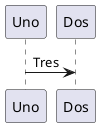

# Uso de Pandoc para la creación de documentación

## Introducción

La creación de documentación en varios ámbitos es de gran importancia, por ello mantener un formato sin añadir complicación a la edición es que se recurre a lenguajes de marcado como Markdown. Pero el estándar de Internet es PDF (del inglés: Portable Document Format) así que se utiliza programas como Pandoc que transforman los archivos de Markdown (.md) a otros formatos [@pd2024].

En el presente documento se da una explicación en base a ejemplos del uso de Markdown para obtener documentos con formato y estilo.

## Instalación de Pandoc

Pandoc es programado en lenguaje Haskell y se encuentra disponible para las plataformas que permite ejecutar algún compilador de ese lenguaje. Por ello tenemos para Linux, Windows, etc.

```bash
# Instalar Pandoc en Debian
sudo apt install -y pandoc
# --
```

También se requieren otros programas como para completar la transformación de Markdown a PDF:

```bash
# Instalar paquetes básicos
sudo apt-get install -y texlive-latex-base texlive-latex-extra

# Instalar paquetes extras
sudo apt-get install -y texlive-fonts-recommended texlive-fonts-extra
# --
```

## Lenguaje Markdown

El lenguaje de marcado Markdown creado en 2004, pero con estandarización desde 2012, sirve para dar formato a documentación en plataformas como GitHub. Sin embargo, existen varias extensiones agregado nuevos elementos que se van utilizando en diferentes contextos, por ejemplo: títulos, notas, bibliografía, etc. Ver @doc2024

## Elementos comunes en documentación

### Notas de pie de página

Ejemplo de nota [^1].
Nota en la misma línea ^[Nota en la misma línea]

[^1]: Nota de pie de página.

```md
<!-- Nota pie de página -->
Ejemplo de nota [^1]

[^1]: Nota de pie de página.

<!-- Nota en la misma línea -->
Nota en la misma línea ^[Nota en la misma línea]
<!---->
```

### Tablas

Normal | Derecha | Centro | Izquierda
--     | --:     | :--:   | :--
1 1    | 1 2     | 1 3    | 1 4
2 1    | 2 2     | 3 3    | 2 4
3 1    | 3 2     | 3 3    | 3 4

```md
<!-- Tabla -->
Normal | Derecha | Centro | Izquierda
--     | --:     | :--:   | :--
1 1    | 1 2     | 1 3    | 1 4
2 1    | 2 2     | 3 3    | 2 4
3 1    | 3 2     | 3 3    | 3 4
<!---->
```

### Figuras


```md
<!-- Agregar una figura -->

<!---->
```

### Diagramas en PlantUML



```md
<!-- Usando PlantUML en un
bloque de código `plantuml` -->
@startuml
Uno -> Dos: Tres
@enduml
<!---->
```

### Citar

Requiere un archivo `.bib`, ver @bib2024.

```md
<!-- Citar -->
@doc2024 o con [@doc2024], ver Anexo 1.
<!---->
```

### Referencias

```md
<!-- Agregar bibliografía utilizada -->
::: {#refs}
:::
<!---->
```

## Documento PDF

Los documentos PDF son de gran importancia por su característica de conservar su estilo sin importar el dispositivo o aplicación donde se visualice. El documento también permite conservar metadatos los cuales podemos configurar:

```yml
# meta.yml
title: Uso de Pandoc para la creación de documentación
author: Irving Montalvo
date: Ago 14, 2024
papersize: a4
fontsize: 12pt
geometry: margin=2.5cm
keywords: pandoc markdown documentación
subject: Creación de documentación con markdown, fórmulas y gráficos matemáticos

# Activar la tabla de contenidos
toc: true
toc-title: "Índice"

# Archivo de referencias
bibliography: ./references.bib

# Estilo de la bibliografía
csl: ./apa7.csl

# Agregando código LaTeX al incio
header-includes: |
  \renewcommand{\figurename}{Figura}
# --
```

Para transformar el archivo Markdown a PDF utilizamos:

```bash
# Transformar Mardown a PDF
pandoc --citeproc --filter pandoc-plantuml \
    --lua-filter ./replace.lua \
    --metadata-file ./meta.yml \
    -o doc.pdf ./README.md ./anexos.md
# --
```

## Extendiendo con LaTeX

LaTeX es todo un sistema que permite un mayor detalle en la generación de documentos PDF, pero como se menciona al principio la documentación se requiere mantener simplicidad, aquí algunos ejemplos:

### Fórmula matemática

$$x=\frac{-b\pm\sqrt{b^2-4ac}}{2a}$$

> Donde $ax^2+bx+c=0$

```tex
% Fórmula matemática
$$x=\frac{-b\pm\sqrt{b^2-4ac}}{2a}$$

> Donde $ax^2+bx+c=0$
% --
```

### Otros modificadores de la página

```tex
% Otros modificadores de página
\newpage
\pagestyle{empty}
% --
```

## Extendiendo con filtros

Los filtros permiten agregran nuevas funcionalidades a procesamiento del contenido antes de generar el archivo PDF (ver Anexo 2). Entre los filtros principales tenemos:

```bash
# Instalar otros filtros en Debian
sudo apt install -y pandoc-citeproc-preamble \
    pandoc-filter-diagram pandoc-plantuml-filter
# --
```

## Aspectos adicionales

La documentación de uso académico se rige bajo estándares como APA ^[Aquí se utiliza APA7, ver @apa2022], Chicago, etc. Estándares que requieren formatos muy específicos y bien documentados.

## Conclusión

Buscando la simplicidad en la documentación se usa Markdown y para la presentación formal se hace en un documento PDF, es ahí donde un transformador entre formatos como Pandoc tiene relevancia y en caso de buscar mayor detalle se recurre a sistemas como LaTeX o lenguajes que permiten generar extensiones.

## Referencias

::: {#refs}
:::
